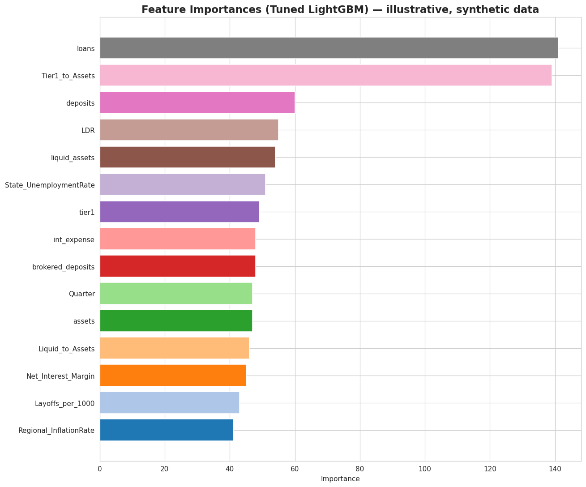

# EWS NexusAI — Bank Risk Early-Warning System

A machine learning pipeline that predicts a continuous **probabilistic risk score** for U.S. banks each quarter, using accounting fundamentals, regional macroeconomic indicators, and labor-market signals (WARN Act layoff filings). Built around an Optuna-tuned LightGBM regressor, benchmarked against three baselines, and validated with SHAP explainability, a feature-group ablation study, and bootstrap significance testing throughout.

> **Provenance note.** This repo is a refactor of an original Colab research notebook (`original_notebook/updated_complete_EWS_nexusai.ipynb`) into a tested, modular pipeline. Three cells in the original notebook raised `NameError` due to out-of-order variable references (`ablation_df`, `predictions` used before being defined in the cell that ran). Those are fixed here by passing data explicitly between functions instead of relying on notebook execution order — see [What was fixed](#what-was-fixed-from-the-original-notebook) below.

---

## Results

Numbers below are from the original notebook's executed run on its real dataset (990 quarterly bank-quarter records, 23 features, time-based 80/20 split).

| Model | Test R² | Test MSE |
|---|---|---|
| **Tuned LightGBM (Optuna)** | **0.920** | **0.0022** |
| Tuned LightGBM (benchmark run) | 0.890 | 0.0030 |
| Random Forest | 0.859–0.860 | 0.0039 |
| XGBoost | 0.832–0.833 | 0.0046 |
| Ridge Regression | 0.203 | 0.0218 |

*(Two rows for LightGBM/Random Forest/XGBoost reflect two separate benchmarking cells in the original notebook with slightly different fit conditions — both are reported rather than silently picking one.)*

**AUROC** (risk score binarized at 0.5 threshold):

| Model | AUROC | 95% CI |
|---|---|---|
| Random Forest | 0.999 | 0.997–1.000 |
| XGBoost | 0.998 | 0.994–1.000 |
| Tuned LightGBM | 0.990 | 0.971–1.000 |
| Ridge Regression | 0.814 | 0.758–0.867 |

Pairwise bootstrap tests found **no statistically significant difference** between Tuned LightGBM, Random Forest, and XGBoost (p > 0.14 for all three pairs) — but all three significantly outperform Ridge Regression (p < 0.0001).

**Optuna best hyperparameters** (40-trial TPE search, 5-fold `TimeSeriesSplit`):
```
num_leaves: 68, max_depth: 4, learning_rate: 0.017, n_estimators: 578,
min_child_samples: 8, subsample: 0.737, colsample_bytree: 0.630,
reg_alpha: 0.053, reg_lambda: 0.084
```


*Illustrative figure generated from this repo's pipeline on synthetic data — replace with your own run's output once real data is loaded.*

---

## How it works

```
                    ┌─────────────────────────┐
                    │   Quarterly bank panel   │
                    │ accounting + macro +     │
                    │ labor-market features    │
                    └────────────┬─────────────┘
                                 ▼
                    ┌─────────────────────────┐
                    │   Preprocessing          │
                    │  time-based train/test   │
                    │  split by Quarter        │
                    └────────────┬─────────────┘
                                 ▼
              ┌──────────────────┴──────────────────┐
              ▼                                      ▼
   ┌─────────────────────┐              ┌─────────────────────────┐
   │ Optuna-tuned LightGBM │              │ Baselines: RF, Ridge,    │
   │ (TimeSeriesSplit CV)  │              │ XGBoost                  │
   └──────────┬───────────┘              └────────────┬─────────────┘
              └──────────────────┬───────────────────┘
                                 ▼
              ┌──────────────────────────────────────┐
              │   Evaluation suite                    │
              │  SHAP · feature-group ablation ·       │
              │  ROC/AUC · Spearman ρ · Precision@K ·  │
              │  bootstrap CIs + significance tests    │
              └──────────────────────────────────────┘
```

---

## Repository structure

```
ews-nexusai/
├── notebooks/
│   └── 01_full_pipeline.ipynb     # End-to-end run using the src/ modules
├── original_notebook/
│   └── updated_complete_EWS_nexusai.ipynb   # Original Colab notebook, kept for provenance
├── src/
│   ├── data/
│   │   ├── loader.py               # Local CSV loading (replaces Colab file upload)
│   │   └── preprocessing.py        # Column cleanup, time-based split, feature groups
│   ├── models/
│   │   ├── lgb_model.py            # Baseline + Optuna-tuned LightGBM, feature importance
│   │   └── baselines.py            # Random Forest, Ridge, XGBoost
│   ├── evaluation/
│   │   ├── bootstrap.py            # Generic bootstrap CI / significance-test routines
│   │   ├── ablation.py             # Feature-group ablation study
│   │   ├── roc_and_correlation.py  # ROC/AUC + Spearman rank-correlation benchmarks
│   │   └── precision_at_k.py       # Precision@K ranking evaluation
│   └── utils/
│       ├── shap_explain.py         # SHAP value computation
│       └── visualization.py        # Shared plotting helpers
├── configs/
│   └── default.yaml                # All paths, hyperparameter ranges, bootstrap counts
├── tests/
│   ├── test_preprocessing.py
│   └── test_evaluation_pipeline.py # Regression tests for the bugs described below
├── results/figures/                # Output plots land here
├── requirements.txt
└── README.md
```

---

## Quickstart

```bash
git clone <your-repo-url>
cd ews-nexusai
pip install -r requirements.txt
```

Update `configs/default.yaml` with the path to your bank panel CSV, then either:

- run `notebooks/01_full_pipeline.ipynb` top to bottom, or
- use the `src/` API directly:

```python
import yaml
from src.data.loader import load_bank_panel
from src.data.preprocessing import prepare_features_and_target, make_time_series_cv
from src.models.lgb_model import tune_lgb_with_optuna, evaluate

config = yaml.safe_load(open("configs/default.yaml"))

df = load_bank_panel(config["data"]["csv_path"])
split = prepare_features_and_target(df, test_fraction=config["data"]["test_fraction"])
tscv = make_time_series_cv(n_splits=config["cv"]["n_splits"])

result = tune_lgb_with_optuna(
    split.X_train, split.y_train, split.X_test, split.y_test,
    cv=tscv, n_trials=config["optuna"]["n_trials"],
)
print(evaluate(result.model, split.X_test, split.y_test))
```

Run the test suite:
```bash
pytest tests/ -v
```

### Expected input schema

The pipeline expects a CSV with one row per bank-quarter and these columns:

- **Target:** `probabilistic_risk_score`
- **Time key:** `Quarter` (integer, used for the chronological train/test split)
- **Metadata** (dropped before modeling): `Bank_Name`, `State`, `Region`, `QuarterLabel`
- **Accounting features:** `loans`, `tier1`, `assets`, `int_income`, `int_expense`, `LDR`, `Tier1_to_Assets`, `Net_Interest_Margin`, `liquid_assets`, `assets.1`, `brokered_deposits`, `deposits`, `Liquid_to_Assets`, `Brokered_to_Deposits`
- **Macro features:** `Regional_InflationRate`, `State_UnemploymentRate`
- **Labor-market features:** `Total_Employees`, `WARN_Layoffs`, `Layoffs_per_1000`, `Num_Layoff_Dates`, `Avg_Notice_to_Layoff_Days`, `Sentiment_of_Failure`

---

## What was fixed from the original notebook

The uploaded notebook (`original_notebook/updated_complete_EWS_nexusai.ipynb`) had real, working analysis — Optuna tuning, SHAP, ablation, bootstrap significance testing, precision@K — but three cells raised `NameError` when run, because they referenced a variable defined in a **different** cell that hadn't been (re-)run first:

| Original cell | Error | Root cause |
|---|---|---|
| Ablation R² plot | `NameError: name 'ablation_df' is not defined` | The plotting code referenced `ablation_df`, but only `ablation_results`/`ci_results` dicts had been built in that cell |
| Spearman correlation benchmark | `NameError: name 'predictions' is not defined` | Code assumed a `predictions` dict existed from an earlier cell, with the dict literal commented out as a reminder rather than executed |
| Precision@K benchmark (first version) | `NameError: name 'predictions' is not defined` | Same pattern as above |

This is a notebook-execution-order bug, not a logic bug — the working version of the ablation logic (which **does** build `ablation_df` correctly) and the working version of the precision@K logic (which **does** define `predictions` explicitly) exist later in the same notebook. The refactor in `src/evaluation/` keeps the correct version of each and makes every function take its inputs as explicit arguments, so there's no dependency on cell execution order. The `google.colab.files.upload()` call (Colab-only, cell 2) is also replaced with a plain local-path loader in `src/data/loader.py` so the pipeline runs outside Colab.

Regression tests for all three fixed code paths live in `tests/test_evaluation_pipeline.py`.

---

## To-Do

- [ ] Point `configs/default.yaml` at your real bank panel CSV and confirm the schema matches
- [ ] Re-run `notebooks/01_full_pipeline.ipynb` against real data and replace the illustrative figure in `results/figures/`
- [ ] Decide on a versioned/refreshed data pull cadence if this is meant to run on new quarters going forward
- [ ] Add a model card documenting intended use, limitations, and the small-sample caveat (990 records, 23 features — confirm out-of-sample generalization before any production use)
- [ ] Consider adding calibration plots (predicted vs. actual risk score) alongside R²/MSE, since this is a risk-scoring use case where calibration matters as much as rank accuracy
- [ ] Add CI (GitHub Actions) to run `pytest tests/` on every push
- [ ] Pin dependency versions in `requirements.txt` once the target environment is finalized
